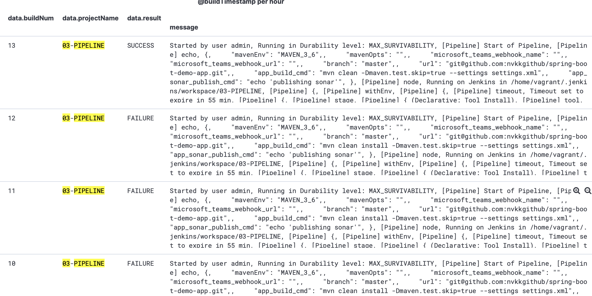
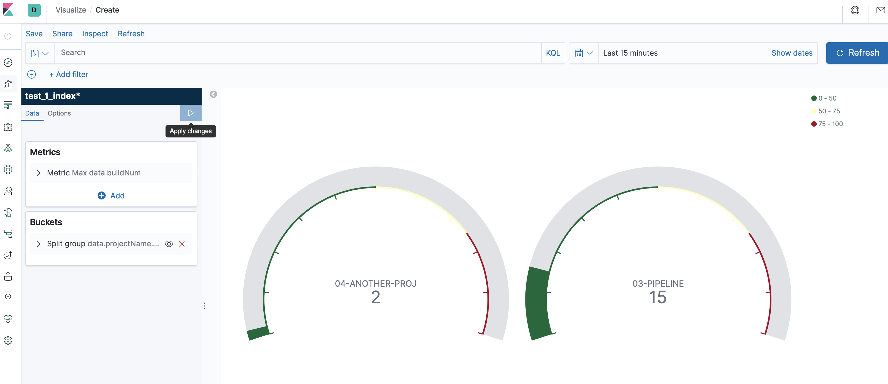
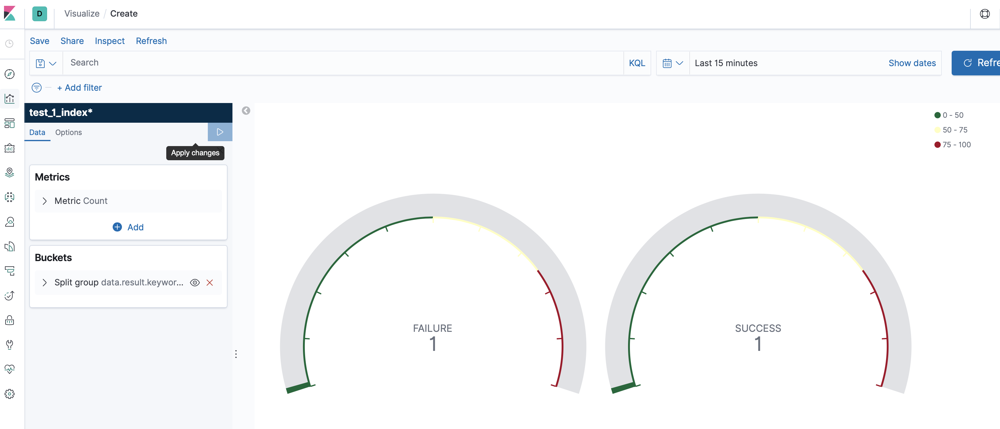

## Enterprise CI using Infrastructure As Code
This repository contains code to provision infrastructure on AWS cloud for Enterprise CI platform.

#### Objective: 
* Provision Highly scalable, available and fault-tolerant enterprise-ci platform.
* Provide the monitoring dashboards and alerts.
* Provide consumable CI pipeline with Pipeline As Code.

#### Practices/Tools

##### Packer
* Create AMI with required softwares as needed for Jenkins Master and Slave. 

* Create AMI for SONAR, ELK stack.

* [Packer](packer/README.md)

##### Terraform

* Terraform - Provision infra  with templates i.e., 'Infrastack', 'EC2-ALB-stack', 'EC2'. This will enable reusability.

* [Terraform code](terraform/README.md)

##### Groovy Template : Pipeline As Service
* Consumable CI pipeline as a service for all applicable maven and java projects.

(https://github.com/nvkkgithub/enterprise-ci-shared-libs.git)


### AWS - Deployment Architecture


### ELK - Monitoring Dashboards

#### Dashboard by Status


#### Dashboard by Projects


#### Dashboard by Status


### Usage

#### Packer - Create AMI 

##### Assumptions:
* AWS IAM role created with access to VPC - full access, EC2 - full acess 

* Access details i.e., 'access-key' and 'secret-key' details will be passed as parameters to create command.

* MAKE file creation in-progress

```
make jenkins-master-ami/create -aws_access_key=<access-key> -aws_secret_key=<secret-key>
make jenkins-slave-ami/create -aws_access_key=<access-key> -aws_secret_key=<secret-key>
```

### Terraform - Provision Infrastructure

##### Assumptions:
* AWS IAM role created with access to VPC-FullAccess, EC2-FullAccess, S3-Read/Write access. 
* Access details i.e., 'access-key' and 'secret-key' are configured with profile name 'vk_env_admin_user'
* Use below command to provision.

```
make jenkins-master/create
make jenkins-master/destroy
make jenkins-slave/create
make jenkins-slave/destroy
```

