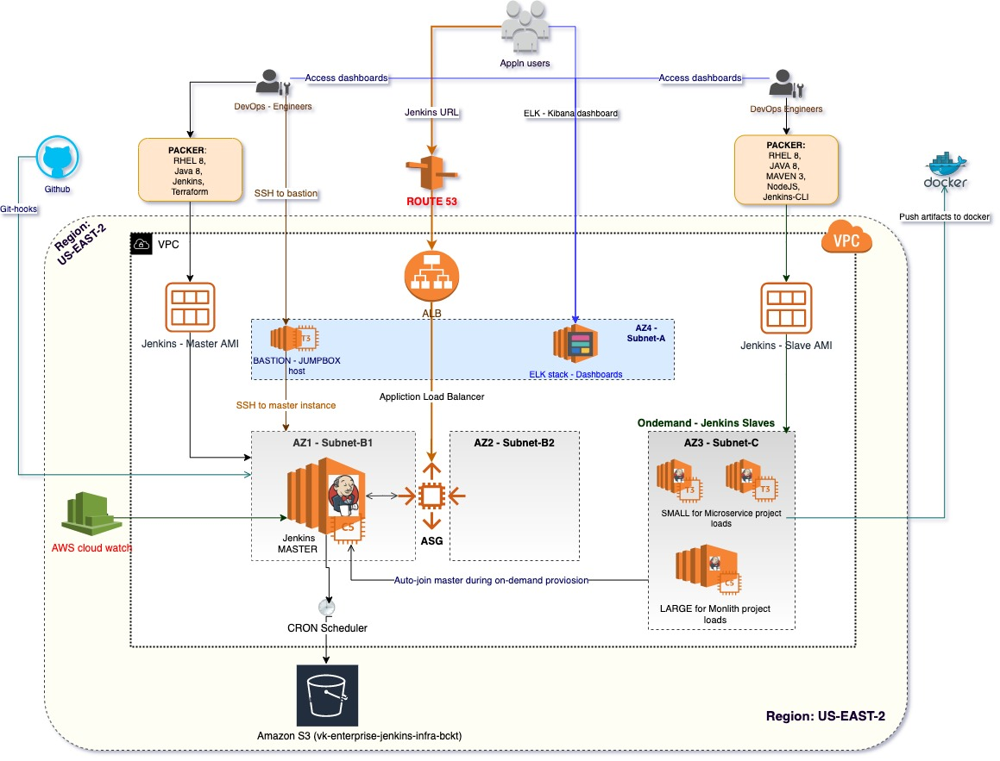
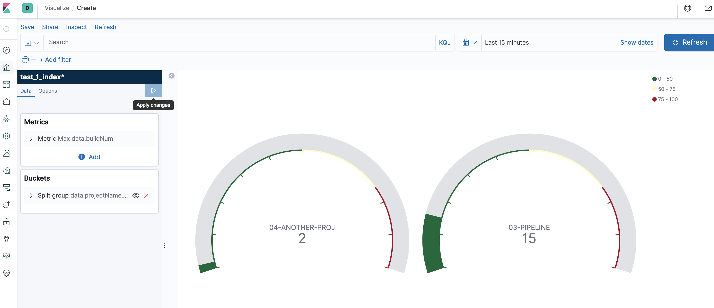
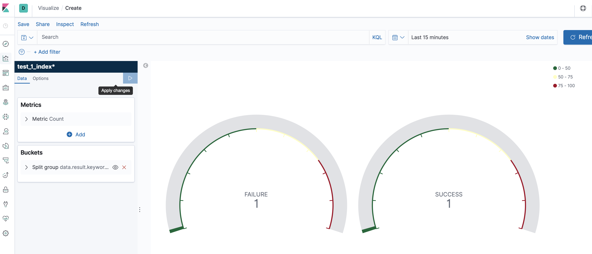

## Enterprise CI using Infrastructure As Code
This repository contains code to provision infrastructure on AWS cloud for Enterprise CI platform.

This repository uses below two Hashicorp tools
* Packer - for creating AMIs with required softwares (Java, Maven, Jenkins..etc) as needed for Jenkins Master and Slave. 
** For more details refer to "/packer/readme.md" folder.

* Terraform - to provision different types of infrastrcuture individually i.e., 'Infrastack', 'EC2-ALB-stack', 'EC2'. This will enable reusability.
** For more infromation refer


### AWS - Deployment Architecture


### ELK - Monitoring Dashboards

#### Dashboard by Projects


#### Dashboard by Status


### Usage

#### Packer - Create AMI 

##### Assumptions:
* AWS IAM role created with access to VPC - full access, EC2 - full acess 

* Access details i.e., 'access-key' and 'secret-key' details will be passed as parameters to create command.

* MAKE file creation in-progress

```
make jenkins-master-ami/create -aws_access_key=<access-key> -aws_secret_key=<secret-key>
make jenkins-slave-ami/create -aws_access_key=<access-key> -aws_secret_key=<secret-key>
```

### Terraform - Provision Infrastructure

##### Assumptions:
* AWS IAM role created with access to VPC-FullAccess, EC2-FullAccess, S3-Read/Write access. 
* Access details i.e., 'access-key' and 'secret-key' are configured with profile name 'vk_env_admin_user'
* Use below command to provion.

```
make jenkins-master/create
make jenkins-master/destroy
make jenkins-slave/create
make jenkins-slave/destroy
```

